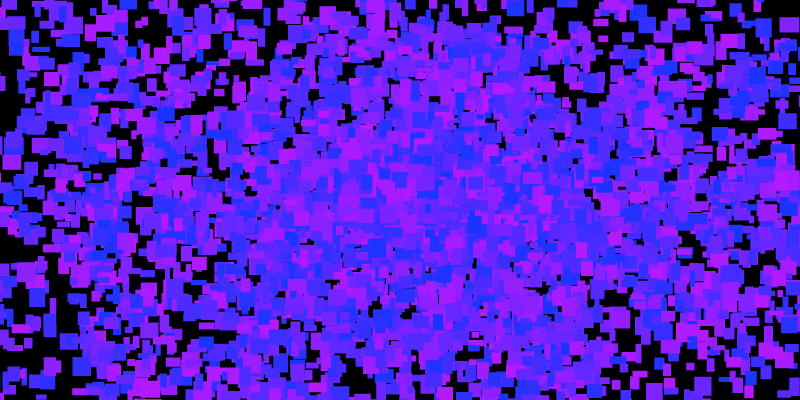
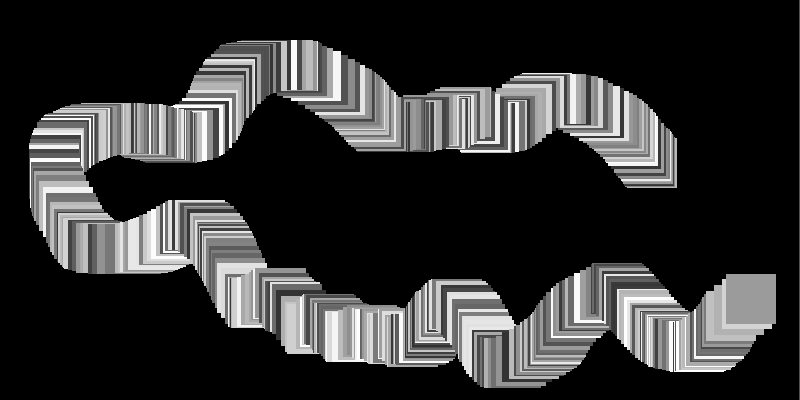

# Graphics #

**Introduction TDB**

## 1. Drawing Basic Shapes, and Then Drawing Many, Many Basic Shapes ##

**[Note: Insert Section on Setup/Update/Draw]**

**[Note: Insert Section on XY coordinate system]**

You might be wondering why we would start with making digital brushes?   

We will get coding as soon as possible and survive this chapter together.

To get started creating brushes, we need to find the basic building blocks of graphics.  You can classify the 2D graphics functions that openFrameworks provides into two categories: predefined shapes and freeform shapes.  The predefines shapes are rectangles, circles, triangles and straight lines.  The freeform shapes are polygons and paths.

### 1.1 Predefined Shapes ###

#### 1.1a Drawing to the screen! ####

Okay, okay.  Time for actual code.  Add the following line to your `draw()` function and like magic you will have an empty, empty, black void of a window on your screen.

```c++
    ofBackground(0);
```

Now that we have our background in place, we can start drawing on top of it.  Let's draw a rectangle, a circle, an ellipse, a triangle and some straight lines by adding the following lines to the end of the `draw()` function:

```c++
    ofSetColor(0);
    
    // Let's draw some filled shapes
    ofRect(50, 50, 100, 100);
    ofCircle(250, 100, 50);
    ofEllipse(400, 100, 80, 100);
    ofTriangle(500, 150, 550, 50, 600, 150);
    ofLine(700, 50, 700, 150);
```

The first line of code tells openFrameworks what color it should be using when drawing.  You can think of it as telling openFrameworks to pull out a particular colored sharpie - it will draw in that color until you tell it to switch to another color.  We'll be exploring how you can specify color as we go, but for now, we are using grayscale colors.  If you pass in a single integer value (between 0 and 255) to [`ofSetColor`](http://openframeworks.cc/documentation/graphics/ofGraphics.html#show_ofSetColor "ofColor Documentation Page"), openFrameworks will interpret that as a grayscale color where 0 is black (i.e. no light) and 255 is white (i.e. all light).

Now that we have color squared away, we make use of some handy functions to draw shapes: `ofRect`, `ofCircle`, `ofEllipse`, `ofTriangle` and `ofLine`.  The documentation page for [`ofRect`](http://openframeworks.cc/documentation/graphics/ofGraphics.html#!show_ofRect "ofRect Documentation Page") shows that we can create a rectangle in a number of different ways.  Here, we are passing in the x and y values of the top left corner as well as the width and height that we would like, all in that order.  For [`ofCircle`](http://openframeworks.cc/documentation/graphics/ofGraphics.html#show_ofCircle "ofCircle Documentation Page"), we are passing in the x and y values of the center of the circle and the radius.  With [`ofEllipse`](http://openframeworks.cc/documentation/graphics/ofGraphics.html#show_ofEllipse "ofEllipse Documentation Page"), we are passing in the x and y values of the center as well as the width and height.  For [`ofTriangle`](http://openframeworks.cc/documentation/graphics/ofGraphics.html#show_ofTriangle "ofTriangle Documentation Page"), we pass in the x and y positions of the three corners of the triangle.  Finally, with [`ofLine`](http://openframeworks.cc/documentation/graphics/ofGraphics.html#show_ofLine "ofLine Documentation Page"), we pass in the x and y coordinates of the two endpoints of our desired straight line.

And when you run all of that, you should see some filled shapes hanging out in your black void.

But what if you only wanted to draw the outline of the shapes?  There are two functions, [`ofFill`](http://openframeworks.cc/documentation/graphics/ofGraphics.html#!show_ofFill "ofFill Documentation Page") and [`ofNoFill`](http://openframeworks.cc/documentation/graphics/ofGraphics.html#!show_ofFill "ofNoFill Documentation Page") that will allow you to toggle between drawing filled shapes and drawing outlines.  Let's modify our `draw` function again, so that it looks like this:

```c++    
    ofBackground(0);
    
    ofSetColor(255);
    
    ofFill(); // If you omit this and leave ofNoFill(), all the shapes will be outlines!
    
    // Let's draw some filled shapes
    ofRect(50, 50, 100, 100);
    ofCircle(250, 100, 50);
    ofEllipse(400, 100, 80, 100);
    ofTriangle(500, 150, 550, 50, 600, 150);
    ofLine(700, 50, 700, 150);
    
    ofNoFill(); // If you omit this and leave ofFill(), all the shapes will be filled!
    
    // Let's draw some shape outlines
    ofRect(50, 250, 100, 100);
    ofCircle(250, 300, 50);
    ofEllipse(400, 300, 80, 100);
    ofTriangle(500, 250, 550, 50, 600, 150);
    ofLine(700, 250, 700, 350);
```

Here, we've redraw our same shapes but without the fill and shifted down 200 pixels on the screen.  Much like `ofSetColor`, `ofFill` tells openFrameworks that it should be ready to draw filled shapes until it sees `ofNoFill`. (And `ofNoFill` says to draw outlines until the next `ofFill`.)

**[Note: mention why ofLine is lighter than full white]** 

And if you want to control the thickness of the outlines (or the straight lines drawn with `ofLine`), you can use [`ofSetLineWidth`](http://openframeworks.cc/documentation/graphics/ofGraphics.html#show_ofSetLineWidth "ofSetLineWidth Documentation Page").  Again, like `ofSetColor`, `ofSetLineWidth` will effect all lines drawn until the thickness is changed again.  Add the following lines to your `draw` function:

```.cpp

    // Code omitted for clarity ...
    
    ofFill(); // If you omit this and leave ofNoFill(), all the shapes will be outlines!
    ofSetLineWidth(1); // Default value is 1
    
    // Code omitted for clarity ...
    
    ofNoFill(); // If you omit this and leave ofFill(), all the shapes will be filled!
    ofSetLineWidth(2); // Try playing with the value
    
    // Code omitted for clarity ...
```

Okay, so you've got the recipes for some basic shapes down.  Before we start putting those snippets of code to some creative uses, there's one more line of code that you should add, [`ofEnableAntiAliasing`](http://openframeworks.cc/documentation/graphics/ofGraphics.html#show_ofEnableAntiAliasing "ofEnableAntiAliasing Documentation Page").  You might have noticed that your outlines (and ofLines) look a bit blocky.  The lines look like paths of jagged pixels.  We can smooth out these pixels using an anti-aliasing technique.  Luckily, you don't have to do anything other than add `ofEnableAntiAliasing();` to your `setup` function, and poof, smoother lines.  (If you want to understand what's happening under the hood, check out the wiki on [anti-aliasing](http://en.wikipedia.org/wiki/Spatial_anti-aliasing "Wiki on spatial anti-aliasing").


**[Note: Include something about rounded rect]**
**[Note: Include something about layering, explaining screen buffer]**
**[Note: Include something about setting rect mode, circle resolution]**
**[Note: Include something about RGB colors]**


#### 1.1b Drawing to the screen! The fun bits. ####

You surivived the boring bits!

Well, the necessary bits.  Why draw a single rectangle, when you can draw a bagillion?



Let's create a new openFrameworks project and call it something like ShapeBrush.  We are going to just use the basic recipes from the last section and mix in some randomness and repetition to create a digital 'brush.'  When we click somewhere on the screen, we will draw a ton of shapes.  But we need a canvas that doesn't constantly erase itself. openFrameworks clears the screen on with each invocation of `draw`, so enter [`ofSetBackgroundAuto`](http://openframeworks.cc/documentation/graphics/ofGraphics.html#show_ofSetBackgroundAuto "ofSetBackgroundAuto Documentation Page"), which allows us to stop openFrameworks from clearing the screen on each update.  Add the following lines into your `setup` function:

```c++
    ofSetBackgroundAuto(false);
    ofBackground(0); // If you omit this, the screen will be a default gray color
```

`ofSetBackgroundAuto` takes a boolean value, so pass in `false` and then we draw a black background.  **[Note: point to c++ chapter's description of bools?]**   Great!  We've created an exceptionally empty space that we can overload with shapes.

Since we will be doing all our drawing inside of the `draw` function, what we need to create some variables that let us know 1) where the mouse is located on the screen and 2) whether or not the left mouse button is currently pressed.

For 1), we can use two built-in openFrameworks variables `mouseX` and `mouseY`.  These variables are updated internally by openFrameworks. We can use them inside our `draw` function as we would any other integer variables.

For 2), we should take a look at two functions inside your openFrameworks source file (.cpp) that you probably haven't had a need to use yet: [`mousePressed(int x, int y, int button)`](http://www.openframeworks.cc/documentation/application/ofBaseApp.html#show_mousePressed "mousePressed Documentation Page") and [`mouseReleased(int x, int y, int button)`](http://www.openframeworks.cc/documentation/application/ofBaseApp.html#show_mouseReleased) "mouseReleased Documentation Page").  These functions are called by openFrameworks anytime a mouse button is pressed or released.  It recieves the x and y position of the mouse when the mouse was pressed/released as well as an integer representing which mouse button was pressed/released.   We can thus set up a boolean variable, isLeftMousePressed, and change its value inside of these two functions.

So add this to your header file (.h):

```c++
		bool isLeftMousePressed;
```

And add this into the `setup` function of your source file (.cpp):

```c++
    isLeftMousePressed = false;  
```

Now that the boolean variable is set up, add these lines to your `mousePressed` and `mouseReleased` functions:

```c++
void testApp::mousePressed(int x, int y, int button){
    if (button == OF_MOUSE_BUTTON_LEFT) isLeftMousePressed = true;
}

void testApp::mouseReleased(int x, int y, int button){
    if (button == OF_MOUSE_BUTTON_LEFT) isLeftMousePressed = false;
}
```

Whenever a button on the mouse is pressed or released, we want to check if that button is the left mouse button.  If it is, then we can adjust our `isLefMousePressed` boolean appropriately.  The `button` variable is an integer that identifies which button is pressed/released, and openFrameworks provides some handy constants that we can use to identify the button in a human-readable way (`OF_MOUSE_BUTTON_LEFT`, `OF_MOUSE_BUTTON_MIDDLE` and `OF_MOUSE_BUTTON_RIGHT`).  If you really wanted, you *could* just say `button == 0` to test for whether the pressed/released button is the left mouse button.

Let's hop into the `draw` function and start making use of our mouse information:

```c++
    if (isLeftMousePressed) {
        ofSetColor(255);
        ofSetRectMode(OF_RECTMODE_CENTER);
        ofRect(mouseX, mouseY, 50, 50);
    }
```

[`ofSetRectMode`](http://www.openframeworks.cc/documentation/graphics/ofGraphics.html#show_ofSetRectMode "ofSetRectMode Documentation Page") allows us to control how the x and y positions we pass into `ofRect` are used to draw a rectangle.  Like with the mouse button constants, openFrameworks provides some rectangle mode constants for us to use: `OF_RECTMODE_CORNER` and `OF_RECTMODE_CENTER`.  By default rectangles are drawn by interpreting the x and y values you pass to it as the coordinates of the upper left corner (`OF_RECTMODE_CORNER`).  For our purposes, it is more convient for us to specify the center of the rectangle (`OF_RECTMODE_CENTER`) so that our rectangle is centered over the mouse position.  So we draw the center of our white, 50 x 50 rectangle at the mouse position using `mouseX` and `mouseY`.

Boring! We are going to make this a bit more interesting by 1) adding randomness and 2) adding repeptition.

Randomness makes your openFrameworks sketches dark, mysterious and unpredictable.  So meet one of your new friends, [`ofRandom`](http://openframeworks.cc/documentation/math/ofMath.html#!show_ofRandom "ofRandom Documentation Page").  `ofRandom` can be used in two different ways: by passing in two values `ofRandom(float min, float max)` or by passing in a single value `ofRandom(float max)`.  If you pass in two values, they are the minimum and maximum values you want your random value to take.  If you pass in a single value, it is considered to be the maximum value you want and the minimum is assumed to be 0.  So when we go to specify the color of the rectangle we are about to draw, we can substitute a random value:

```c++
        ofSetColor(ofRandom(50, 255));
```

Remember that we are using grayscale colors and that they take on values between 0 and 255.  We can exlude some of the deep black colors because they won't be visible to us when drawing on a black background.  

**[Note: change image to cursive 'hi']**



So whenever you are done drawing weird rectangle snakes, we can move on to adding repetition.


**[Note: Aside on what computer randomness is?]**
**[Note: Point to c++ section on float vs int and casting?]**

Introduce ofVec2f


GO BACK AND INTEGRATE GOOGLE DOC INFO INTO HERE

