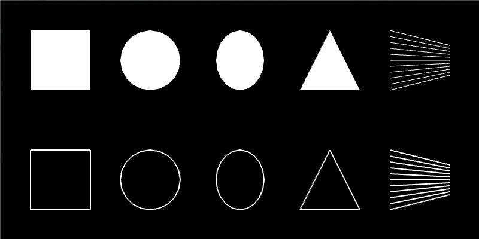

# Graphics #

Introduction TDB

## Drawing Basic Shapes, and Then Drawing Many, Many Basic Shapes ##

**[Insert Section on Setup/Update/Draw]**

You might be wondering why we would start with making digital brushes?   

We will get coding as soon as possible and survive this chapter together.

To get started creating brushes, we need to find the basic building blocks of graphics.  You can classify the 2D graphics functions that openFrameworks provides into two categories: predefined shapes and freeform shapes.  The predefines shapes are rectangles, circles, triangles and straight lines.  The freeform shapes are polygons and paths.

### Predefined Shapes ###

