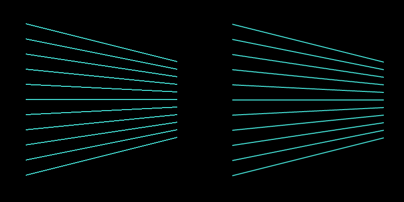

# Graphics #

Introduction TDB

## 1. Drawing Basic Shapes, and Then Drawing Many, Many Basic Shapes ##

**[Insert Section on Setup/Update/Draw]**

**[Insert Section on XY coordinate system]**

You might be wondering why we would start with making digital brushes?   

We will get coding as soon as possible and survive this chapter together.

To get started creating brushes, we need to find the basic building blocks of graphics.  You can classify the 2D graphics functions that openFrameworks provides into two categories: predefined shapes and freeform shapes.  The predefines shapes are rectangles, circles, triangles and straight lines.  The freeform shapes are polygons and paths.

### 1.1 Predefined Shapes ###

#### 1.1a Drawing to the screen! ####

Okay, okay.  Time for actual code.  Add the following line to your `draw()` function and like magic you will have an empty, empty, black void of a window on your screen.

```c++
    ofBackground(0);
```

Now that we have our background in place, we can start drawing on top of it.  Let's draw a rectangle, a circle, an ellipse, a triangle and some straight lines by adding the following lines to the end of the `draw()` function:

```c++
    ofSetColor(0);
    
    // Let's draw some filled shapes
    ofRect(50, 50, 100, 100);
    ofCircle(250, 100, 50);
    ofEllipse(400, 100, 80, 100);
    ofTriangle(500, 150, 550, 50, 600, 150);
    ofLine(700, 50, 700, 150);
```

The first line of code tells openFrameworks what color it should be using when drawing.  You can think of it as telling openFrameworks to pull out a particular colored sharpie - it will draw in that color until you tell it to switch to another color.  We'll be exploring how you can specify color as we go, but for now, we are using grayscale colors.  If you pass in a single integer value (between 0 and 255) to [`ofSetColor`](http://openframeworks.cc/documentation/graphics/ofGraphics.html#show_ofSetColor "ofColor Documentation Page"), openFrameworks will interpret that as a grayscale color where 0 is black (i.e. no light) and 255 is white (i.e. all light).

Now that we have color squared away, we make use of some handy functions to draw shapes: `ofRect`, `ofCircle`, `ofEllipse`, `ofTriangle` and `ofLine`.  The documentation page for [`ofRect`](http://openframeworks.cc/documentation/graphics/ofGraphics.html#!show_ofRect "ofRect Documentation Page") shows that we can create a rectangle in a number of different ways.  Here, we are passing in the x and y values of the top left corner as well as the width and height that we would like, all in that order.  For [`ofCircle`](http://openframeworks.cc/documentation/graphics/ofGraphics.html#show_ofCircle "ofCircle Documentation Page"), we are passing in the x and y values of the center of the circle and the radius.  With [`ofEllipse`](http://openframeworks.cc/documentation/graphics/ofGraphics.html#show_ofEllipse "ofEllipse Documentation Page"), we are passing in the x and y values of the center as well as the width and height.  For [`ofTriangle`](http://openframeworks.cc/documentation/graphics/ofGraphics.html#show_ofTriangle "ofTriangle Documentation Page"), we pass in the x and y positions of the three corners of the triangle.  Finally, with [`ofLine`](http://openframeworks.cc/documentation/graphics/ofGraphics.html#show_ofLine "ofLine Documentation Page"), we pass in the x and y coordinates of the two endpoints of our desired straight line.

And when you run all of that, you should see some filled shapes hanging out in your black void.

But what if you only wanted to draw the outline of the shapes?  There are two functions, [`ofFill`](http://openframeworks.cc/documentation/graphics/ofGraphics.html#!show_ofFill "ofFill Documentation Page") and [`ofNoFill`](http://openframeworks.cc/documentation/graphics/ofGraphics.html#!show_ofFill "ofNoFill Documentation Page") that will allow you to toggle between drawing filled shapes and drawing outlines.  Let's modify our `draw` function again, so that it looks like this:

```c++    
    ofBackground(0);
    
    ofSetColor(255);
    
    ofFill(); // If you omit this and leave ofNoFill(), all the shapes will be outlines!
    
    // Let's draw some filled shapes
    ofRect(50, 50, 100, 100);
    ofCircle(250, 100, 50);
    ofEllipse(400, 100, 80, 100);
    ofTriangle(500, 150, 550, 50, 600, 150);
    ofLine(700, 50, 700, 150);
    
    ofNoFill(); // If you omit this and leave ofFill(), all the shapes will be filled!
    
    // Let's draw some shape outlines
    ofRect(50, 250, 100, 100);
    ofCircle(250, 300, 50);
    ofEllipse(400, 300, 80, 100);
    ofTriangle(500, 250, 550, 50, 600, 150);
    ofLine(700, 250, 700, 350);
```

Here, we've redraw our same shapes but without the fill and shifted down 200 pixels on the screen.  Much like `ofSetColor`, `ofFill` tells openFrameworks that it should be ready to draw filled shapes until it sees `ofNoFill`. (And `ofNoFill` says to draw outlines until the next `ofFill`.)

**[Note: mention why ofLine is lighter than full white]** 

And if you want to control the thickness of the outlines (or the straight lines drawn with `ofLine`), you can use [`ofSetLineWidth`](http://openframeworks.cc/documentation/graphics/ofGraphics.html#show_ofSetLineWidth "ofSetLineWidth Documentation Page").  Again, like `ofSetColor`, `ofSetLineWidth` will effect all lines drawn until the thickness is changed again.  Add the following lines to your `draw` function:

```.cpp

    // Code omitted for clarity ...
    
    ofFill(); // If you omit this and leave ofNoFill(), all the shapes will be outlines!
    ofSetLineWidth(1); // Default value is 1
    
    // Code omitted for clarity ...
    
    ofNoFill(); // If you omit this and leave ofFill(), all the shapes will be filled!
    ofSetLineWidth(2); // Try playing with the value
    
    // Code omitted for clarity ...
```

Okay, so you've got the recipes for some basic shapes down.  Before we start putting those snippets of code to some creative uses, there's one more line of code that you should add, [`ofEnableAntiAliasing`](http://openframeworks.cc/documentation/graphics/ofGraphics.html#show_ofEnableAntiAliasing "ofEnableAntiAliasing Documentation Page").  You might have noticed that your outlines (and ofLines) look a bit blocky.  The lines look like paths of jagged pixels.  We can smooth out these pixels using an anti-aliasing technique.  Luckily, you don't have to do anything other than add `ofEnableAntiAliasing();` to your `setup` function, and poof, smoother lines.  (If you want to understand what's happening under the hood, check out the wiki on [anti-aliasing](http://en.wikipedia.org/wiki/Spatial_anti-aliasing "Wiki on spatial anti-aliasing").




**[Note: Include something about rounded rect]**
**[Note: Include something about setting rect mode, layering graphics, circle resolution]**
**[Note: Include something about RGB colors]**


#### 1.1b Drawing to the screen! The fun bits. ####

You surivived the boring bits!

Well, the necessary bits.  Why draw a single rectangle, when you can draw a bagillion?

